# OFICINA ONLINE

**INDEX**

**Perquè penseu que aquesta és una bona solució al nostre problema.3**

**El pressupost mensual i anual de la despesa del servei a contractar.4**

**Guia de creació de l’usuari administrador/a i usuari/a (Feu servir els comptes de
correu de l’Institut).5**

**Guia de creació de les unitats compartides BACKUP i DOCUMENTS on es vegin els
permisos assignats a cada tipus d’usuari/a.
7**

**Guia d’instal·lació d’adreces directes als escriptoris dels dos tipus d’usuaris:10**

**Administrador/a i usuari/a.10**

**Exemples d’ús de consultar un document per part de l’usuari/a.11**

**Comproveu si un usuari/a pot eliminar sense voler algun document.11**

**Perquè penseu que aquesta és una bona solució
al nostre problema.**

Pensem que aquesta és una bona solució perquè podem tenir la tranquilitat que les dades
estan segures i no es poden perdre i la informació critica també, tenim la tranquilitat que si
pases algun accident natural, robament, o algun altre tipus d’emergència tenim un restpall.
També pensem que és una ventatja poder compartir la informació entre els usuaris i
permetre l’accés a la persona que l’administrador vulgui, i tot això desde el nuvol que els
canvis s’actualitzen a cada moment, i desde la comoditat de tindre accés directe a
l’escriptori

**El pressupost mensual i anual de la despesa del
servei a contractar.**

1. Adjunto imatge i després a la entrega adjunto el document.

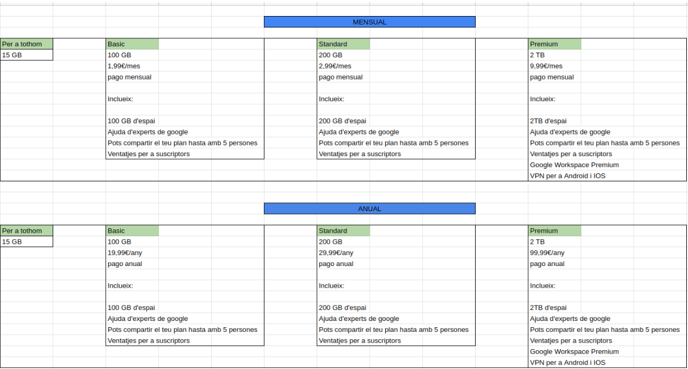

**Guia de creació de l’usuari administrador/a i
usuari/a (Feu servir els comptes de correu de
l’Institut).**

1. El primer que farem sirà accedir al google drive i anirem a “nuevo” i crearem una
“Nueva carpeta” i com la creo jo, siré l’administrador.

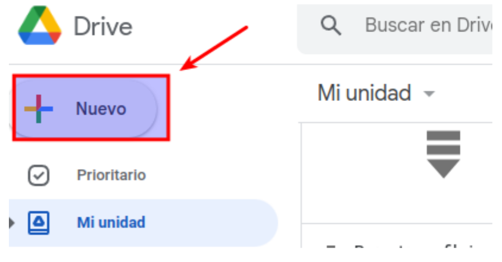

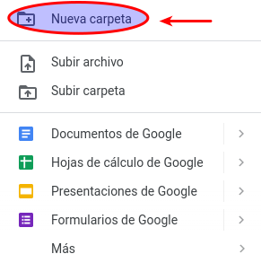

2. Una vegada espitjem sobre “Nueva carpeta” escriurem el nom de “BACKUP”

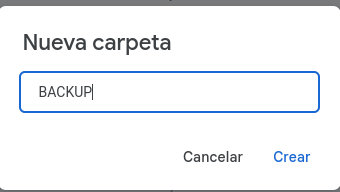

3. Una vegada creada ens ficarem sobre la carpeta i espitjarem el click dret i espitjarem
on diu “Compartir” i com podem veure jo sóc el propietari.

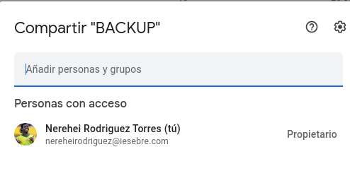

**Guia de creació de les unitats compartides
BACKUP i DOCUMENTS on es vegin els
permisos assignats a cada tipus d’usuari/a.**

1. El primer que farem sirà anar el compte de google drive i anirem a “Nuevo”

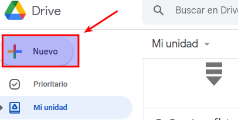

2. Una vegada aquí espitjarem sobre “Nueva carpeta”

3. Aqui ficarem el nom de “Documents”

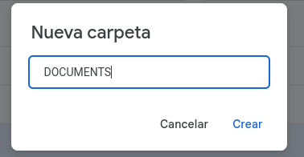

4. Una vegada creada ens ficarem sobre la carpeta i espitjarem el click dret i espitjarem
on diu “Compartir”

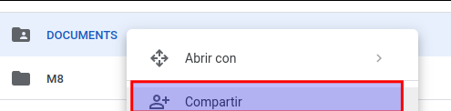

5. I la compartirem amb el company amb només de permisos de lectura, per donar-li
aquestos permisos anirem a la flecheta i alli ens donarà diferents accions, propietari,
editor, lector etc

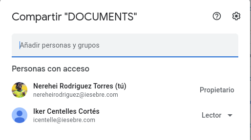

**Guia d’instal·lació d’adreces directes als
escriptoris dels dos tipus d’usuaris:
Administrador/a i usuari/a.**

Per poder fer este apartat, tindrem com compartir la nostra adreça amb el ordinador
corresponen:

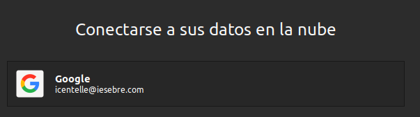

Un cop connectat ya podrem compartir tot tipus d'arxius de la nostra adreça amb el
ordenador:

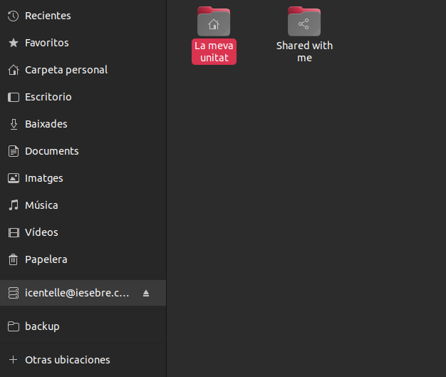

**Exemples d’ús de consultar un document per
part de l’usuari/a.**

Per a carpetes, al ser usuari no es pot crear cop tipo de arxiu:

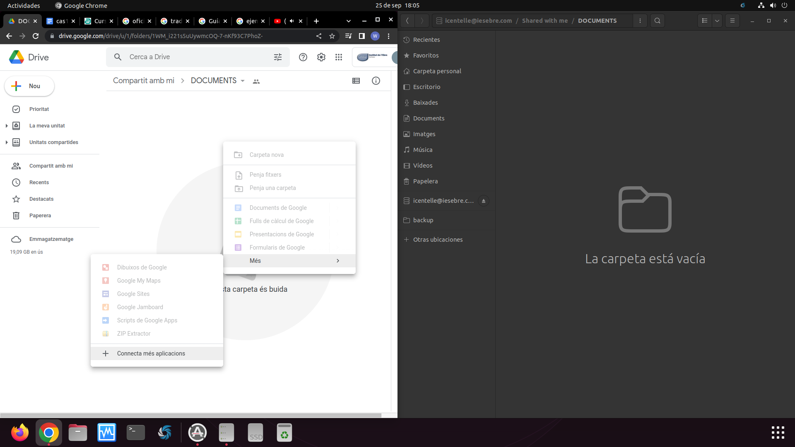

I per als fitxer, sol ens deixa observar, i si volem editar tenim que demanar permis de
edicio:

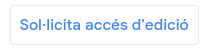

**Comproveu si un usuari/a pot eliminar sense
voler algun document.**

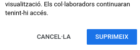

