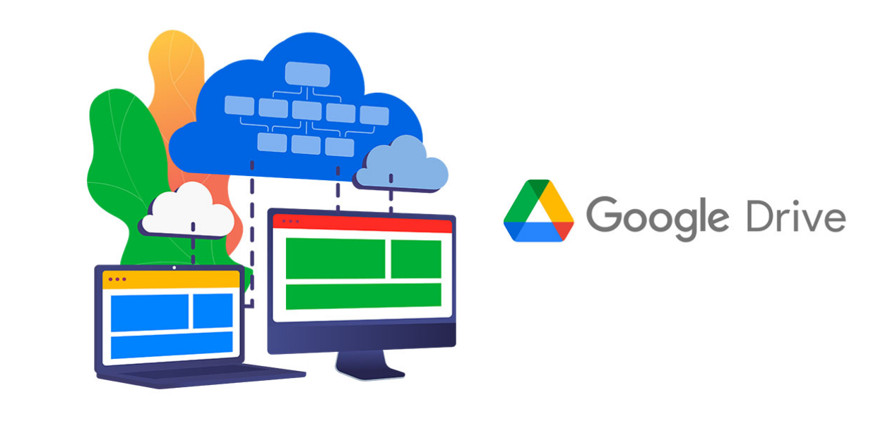

# OFICINA ONLINE

**INDEX**

**Perquè penseu que aquesta és una bona solució al nostre problema.3**

**El pressupost mensual i anual de la despesa del servei a contractar.4**

**Guia de creació de l’usuari administrador/a i usuari/a (Feu servir els comptes de
correu de l’Institut).5**

**Guia de creació de les unitats compartides BACKUP i DOCUMENTS on es vegin els
permisos assignats a cada tipus d’usuari/a.
7**

**Guia d’instal·lació d’adreces directes als escriptoris dels dos tipus d’usuaris:10**

**Administrador/a i usuari/a.10**

**Exemples d’ús de consultar un document per part de l’usuari/a.11**

**Comproveu si un usuari/a pot eliminar sense voler algun document.11**

**Perquè penseu que aquesta és una bona solució
al nostre problema.**

Pensem que aquesta és una bona solució perquè podem tenir la tranquilitat que les dades
estan segures i no es poden perdre i la informació critica també, tenim la tranquilitat que si
pases algun accident natural, robament, o algun altre tipus d’emergència tenim un restpall.
També pensem que és una ventatja poder compartir la informació entre els usuaris i
permetre l’accés a la persona que l’administrador vulgui, i tot això desde el nuvol que els
canvis s’actualitzen a cada moment, i desde la comoditat de tindre accés directe a
l’escriptori

**El pressupost mensual i anual de la despesa del
servei a contractar.**

1. Adjunto imatge i després a la entrega adjunto el document.
