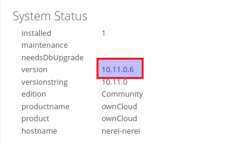

# Activitat 3:
Per fer aquesta activitat comptem amb que **ja s'ha configurat el servei Owncloud a una Màquina Virtual** (MV).

**3.1.-** Llista els Virtual Hosts d'Apache per tal de veure si **owncloud.XYZ.com** està habilitat amb la comanda:

apache2ctl -S

**RESPOSTA**

**3.2.-** A Owncloud podem veure que hi ha una serie de carpetes per defecte, mostra la ruta real a les tres carpetes dins de la teva MV.

**RESPOSTA**

**3.3.-** Al directori **Learn more about owncloud** hi ha informació en forma de fitxers pdf. Consulta'ls i respon aquestes preguntes:

- Quin són els tres tipus de protecció de dades que ofereix Owncloud?
- Fes una petita descripció de cada un d'ells.
- Per quina raó ens recomana utilitzar Owncloud per als documents de Microsoft Office de la nostra empresa?  
- Això passa a tots els països?
- Quina és la llicència d'OWncloud Enterprise?
- I la d'Owncloud Standard?
- Es poden veure videos en Streaming directament des de Owncloud?
- Es poden connectar directoris de Google Drive a Owncloud?
- I Dropbox?
- Compta Owncloud amb antivirus? En cas afirmatiu com es diu? 

1: Els tipus de protecció de dades que ofereix owncloud es: Cifratge de dades de caràcter personal, Integritat i resilliència de els sistemes, transparència i procediment i disponibilitat i accés.

2: CIFRATGE DE DADES DE CARÀCTER PERSONAL: Fà un xifratge d'extrem a extrem del costat del client, del costat del server amb ajuda del HSM

INTEGRITAT I RESILLIÈNCIA DELS SISTEMES: Es detecten els canvis en arxius inclus si son de una carga gran, ofereix autentificació de molts de factors, gestió de perfils, registre d'audiotoría, verificació d'integritat dels arxius, autentificació, clasificació i polítiques de documents.

DISPONIBILITAT I ACCÉS: Sempre està garantitzat ja que te protecció integrada contra ransomware.

TRANSPARÈNCIA I PROCEDIMENT: Owncloud ve amb un mmòdul d'auditoria/registra, una gestió d'autoritzacions transparent.

3:Perquè han creat aquesta integració per a oferir als usuaris un treball més eficient ja que els permet treballar desde un navegador amb una interfaç que es diu WOPI que es de plataforma oberta de la aplicació web. quan es connecten owncloud enterprise i el office online server tens aquestes característiques clau: Fluxe de treball àgil entre owncloud enterprise i office online server, capacitats d'edició completes d'office al navegador, bloqueig d'arxius per una millor col·laboració, col·laboració sencilla amb el botó compartir.

4: Si

5:Té un tipus de llicència AGPL

6:Les tres versions tenen llicència AGPL

7:Té una característica de transmissió de video.

8: Si, es poden connectar

9: També

10: Si, compta amb un antivirus que es diu ClamAV que aquesta ferramenta es de codi obert

**3.4.-** Mostra els següents canvis de paràmetres d'usuari:

- Posa't una imatge d'usuari.

- Afegeix el teu mail de l'Institut.

- Canvia l'idioma a català.

- Mostra la versió d'Owncloud instal·lada.

1: El que farem sirà anar a General 

2: Baixarem una mica i trobarem system status i a la 4 linea fica que es la versió 10.11.0.6

