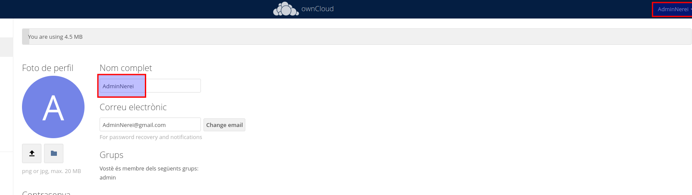
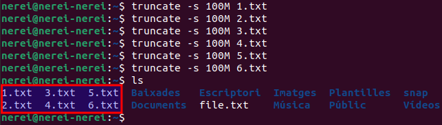
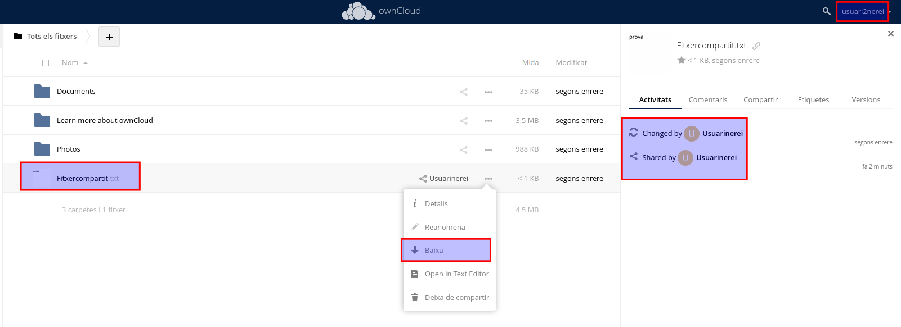

# Activitat 4:

## Gestió d'usuaris:

Hi ha dos tipus d'usuaris, els admins amb permissos per gestionar Owncloud i els usuaris normals.

On fica resposta afegeix una captura de pantalla on es vegi que has fet l'acció que es demana.

**Aquesta part de la pràctica la feu amb un company/a, li creeu un usuari i li doneu el vostre nom de domini d'Owncloud.**

Per a que pugui accedir necessitarà:

- La MV amb owncloud ha d'estar en mode "adaptador pont".
- El fitxer /etc/hosts del company ha de tenir la IP de la MV i el nom de domini de la MV del company/a.


**4.1.-** Crea un usuari admin que es digui adminXYZ, on XYZ són les inicials del teu nom:


**4.2.-** Inicia sessió com a l'usuari adminXYZ.



**4.3.-** Crea un usuari XYZ on XYZ son les inicials del company/a i afegeix-lo al grup usuaris, aquest usuari tindrà una quota de 512 MB.


**4.4.-** Podem crear fitxers d'una mida determinada a Linux amb la comanda:

```
truncate -s 10M file.txt
```

A l'exemple es crea un fitxer de 10MB.


Crea 6 fitxers de 100MB i pujal's a Owncloud un per un.



**4.5.-** Mostra el missatge d'error per haver superat la quota d'usuari.


**4.6.-** Busca al teu perfil quin percentatge de quota estas utilitzant.


**4.7.-** Canvia la quota de l'usuari a 1GB i mostra tots els fitxers pujats.


**4.8.-** Crea un usuari anomenat usuari2XYZ i fical al grup usuaris.


**4.9.-** Comparteix un fitxer de usuariXYZ a usuari2XYZ i mostra com l'usuari2XYZ pot veure i descarregar el fitxer.




.png)

**4.10.-** Esborra la carpeta Learn more about owncloud.
